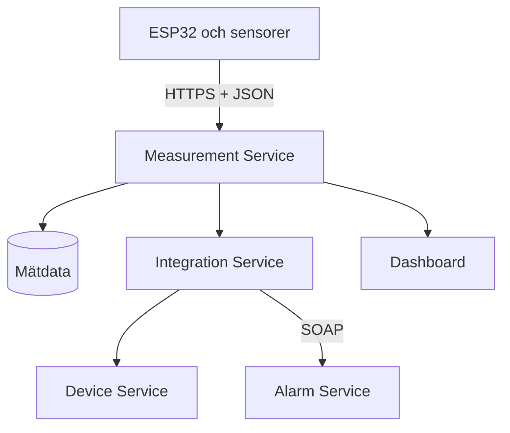

# IoT Monitoring System

Ett distribuerat IoT-system som tar emot mätvärden från fysiska sensorer, lagrar dem, kontrollerar registrerade enheter och skapar larm när ett gränsvärde överskrids.

Projektet kombinerar ESP32-producenter, REST-kommunikation, SOAP, SQL-databaser och en enkel dashboard.

## Systemöversikt



1. En sensor skickar en mätning till Measurement Service.
2. Mätningen sparas och får ett unikt mät- och korrelations-ID.
3. Integration Service kontrollerar att enheten finns i Device Service.
4. Mätningen skickas till Alarm Service genom SOAP.
5. Alarm Service jämför värdet med konfigurerade gränsvärden och kan skapa ett larm.
6. Mätningarna kan visas i dashboarden.

## Tjänster

| Tjänst | Port lokalt | Ansvar |
|---|---:|---|
| Measurement Service | `8080` | Tar emot, lagrar och visar mätningar |
| Integration Service | `8081` | Samordnar REST- och SOAP-kommunikation |
| Device Service | `8082` | Registrerar och verifierar enheter |
| Alarm Service | `8083` | Kontrollerar gränsvärden och hanterar larm |

Backend-tjänsterna är byggda med Java 21, Spring Boot och Maven. Data lagras med Spring Data JPA i Microsoft SQL Server. H2 används i vissa tester. Tjänsterna driftsätts till Azure genom GitHub Actions.

## Viktiga endpoints

| Metod | Endpoint | Funktion |
|---|---|---|
| `POST` | `/api/measurements` | Tar emot en ny mätning |
| `GET` | `/api/measurements` | Hämtar alla mätningar |
| `GET` | `/api/measurements/{id}` | Hämtar en mätning |
| `POST` | `/api/devices` | Registrerar en enhet |
| `GET` | `/api/devices` | Hämtar registrerade enheter |
| `GET` | `/api/devices/{deviceId}` | Hämtar en enhet |
| `POST` | `/api/integration/measurements` | Validerar och vidarebefordrar en mätning |
| SOAP | `/ws` | Behandlar mätningar och larm |

Dashboarden finns i Measurement Service och hämtar data från `/api/measurements`.

## JSON-format

Producenterna skickar mätningar i följande format:

```json
{
  "deviceId": "Hum-01",
  "measurementType": "humidity",
  "value": 58.4,
  "unit": "%",
  "timestamp": "2026-09-24T12:30:45Z"
}
```

Alla fem fält krävs. Vid ett lyckat POST-anrop svarar Measurement Service med `201 Created`.

## Producenter

Producenterna finns i mappen `producers/`. Exempelvis använder `Hum-01` en ESP32 och DHT22 för att läsa luftfuktighet och skicka en ny mätning ungefär var 30:e sekund.

Producenternas lokala Wi-Fi-uppgifter och API-adresser ska lagras i en ignorerad konfigurationsfil och aldrig laddas upp till Git.

## Köra projektet lokalt

### Krav

- Java JDK 21
- Maven
- Tillgång till konfigurerad SQL-databas
- Arduino IDE för ESP32-producenterna

Varje backend-tjänst är ett eget Maven-projekt. Starta en tjänst från dess mapp:

```bash
mvn spring-boot:run
```

Tjänsterna behöver miljövariabler för databas och kommunikation, bland annat:

```text
AZURE_SQL_URL
AZURE_SQL_USERNAME
AZURE_SQL_PASSWORD
DB_URL
DB_USERNAME
DB_PASSWORD
INTEGRATION_SERVICE_URL
DEVICE_SERVICE_URL
ALARM_SERVICE_URL
```

Alarm Service använder även `MAIL_*`-variabler om e-postnotifiering ska aktiveras. Hemligheter ska anges lokalt eller i Azure och får inte committas.

## Test

Kör tester för en tjänst från dess mapp:

```bash
mvn test
```

Ett enkelt systemtest är att:

1. Registrera producentens `deviceId` i Device Service.
2. Starta producenten och skicka en mätning.
3. Kontrollera att producenten får HTTP-status `201`.
4. Kontrollera att mätningen syns i dashboarden.
5. Ändra sensorvärdet och verifiera att Alarm Service behandlar avvikelsen.

## Projektstruktur

```text
producers/   ESP32- och sensorkod
services/    Measurement, Integration, Device och Alarm Service
database/    Databasschema
docs/        Arkitekturdokumentation
.github/     Bygg- och deploymentflöden
```

## Säkerhet

- Lösenord och anslutningssträngar ska inte lagras i Git.
- Producenterna ska använda HTTPS mot publika tjänster.
- Servercertifikat bör verifieras i en produktionsmiljö.
- Miljövariabler används för databaser, tjänsteadresser och e-postkonfiguration.
